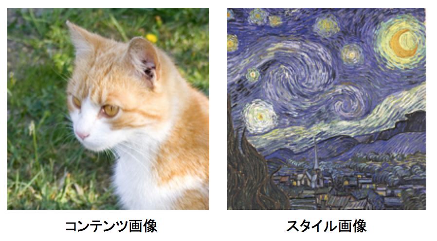
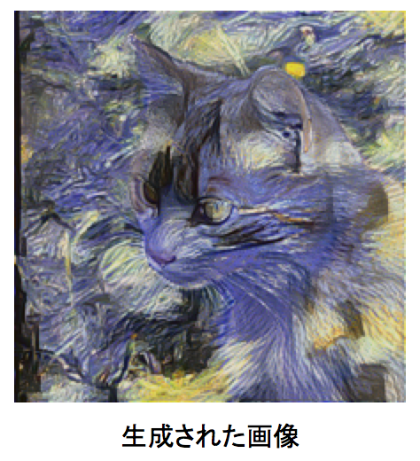
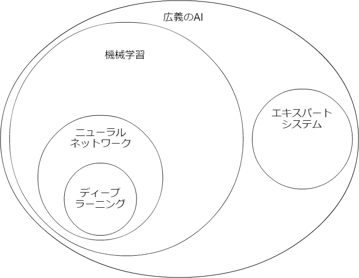
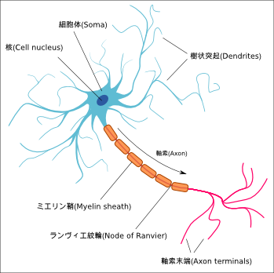
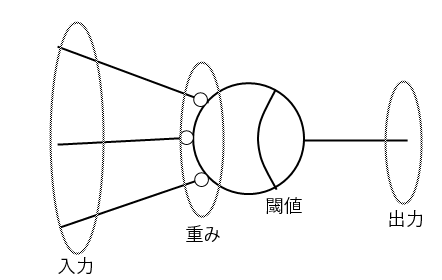
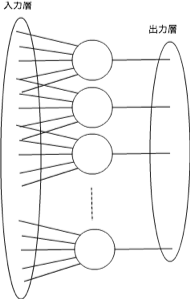
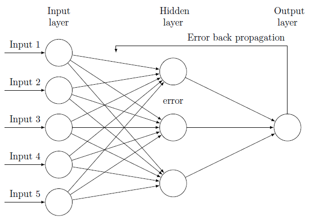
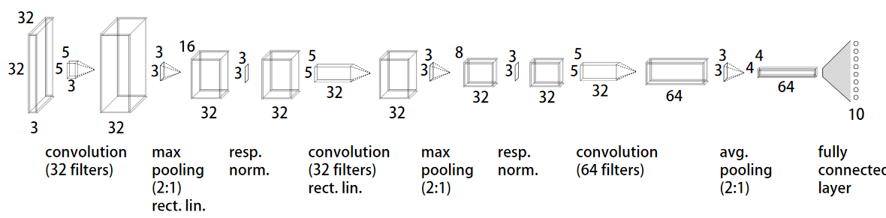

# 長野ディープラーニングハンズオン

- 2017/5/20
- NSEG / GEEKLAB.NAGANO
- さとうきよし
- @stealthinu
- 白馬在住

# スケジュールなど

- 10:00-13:00 午前の部
- 13:00-14:00 お昼休み
- 14:00-17:00 午後の分

だいたい1時間毎に小休憩の予定です。  
わからないことについてはお気軽に言ってください。長くかかりそうな問題についてはTAの方と一緒に解決していきます。  
ハッシュタグ「#nseg」でtweetしていただくと、後から拾ってフォローします。

# ハンズオンの主な内容

- 人力ニューロンになってニューロンの学習方法を学ぶ
- パーセプトロンの実装
- バックプロパゲーションの学習方法の説明
- バックプロパゲーションの実装
- ディープラーニングで導入された手法の説明
- ネオコグニトロンの説明
- 畳み込みニューラルネットワーク(CNN)の構造説明
- CNNの実装
- Kerasを利用してCNNの実装

# ハンズオンの方向性

- ディープラーニング/ニューラルネットが動く原理を学ぶことが目的
- 速度やシンプルさより理解しやすいコードを使う
- アルゴリズムの説明をなるべくそのまま実装する
- コンセプトは「ゼロから作るDeep Learning」と近い  
https://www.oreilly.co.jp/books/9784873117584/  
とても良書なのでおすすめです

# そもそもどうして<br>ハンズオンをやるのか

- 僕がニューラルネットワーク好きだから  
第２期ニューラルネットブームのときにニューロやりたくて大学に入る  
が大学でスキーにはまり研究には打ち込まず白馬に移住して現在に至る
- 仕組みがわからないとサンプルは動かせてもそこから先どうしたらいいかわからない…
- どうして学習出来るのか仕組みを理解してもらいたい

# 画風変換

『画風を変換するアルゴリズム』  
https://research.preferred.jp/2015/09/chainer-gogh/  


→


- 『画風変換動画』https://www.youtube.com/watch?v=Khuj4ASldmU  
- 『Prisma』http://www.prisma-ai.com/

# 線画着色

『初心者がchainerで線画着色してみた。わりとできた。』  
http://qiita.com/taizan/items/cf77fd37ec3a0bef5d9d  


- 『PaintsChainer』https://paintschainer.preferred.tech/index_ja.html

# テキストから画像生成

『StackGAN』  
https://arxiv.org/abs/1612.03242

「This bird is gray with white on its chest<br> and has a very short beak」  


# ディープラーニングの位置



# ディープラーニングの位置2

- 広義のAI
- 機械学習 ←→ エキスパートシステム
    - エキスパートシステム  
    ルールを与えて「演繹的」に知能を作ろうとした
    - 機械学習  
    多数の事例から「帰納的」に自分でルールを見つける
- ニューラルネットワーク  
生物の神経細胞の動きをまねて認識などの処理を行なう
- ディープラーニング  
深い層を持つニューラルネットワーク

# ニューロン



- 神経細胞の模式図
- ヘッブの学習則  
「ニューロンの発火により繋がったニューロンが発火すると結合が強化される」  

# パーセプトロン

 

- ニューロンという神経細胞モデルで脳をモデル化
- 最初期のニューラルネットワーク
- 基本的な学習方法はディープラーニングもだいたい同じ

# バックプロパゲーション



- パーセプトロンを多層にしても学習可能にした
- 教師信号が出力層から入力層へ向かって伝搬していくのでバックプロパゲーションと呼ばれる

# ディープラーニング



- バックプロパゲーションを単に多層にしてもうまく学習が収束しなかった
- 技術的工夫により超多層でも収束するようになった
- 畳み込みニューラルネット(CNN)は画像認識でよく使われている

# 「マッチ箱の脳」を演習
- 手で計算
- 紙か表計算上に書いてく
- 最初の２、３回はみんなで一緒にやる
- 終わったらみんなで検算する
- 注意点
    - パラメータが１つで個数を変更するモデルでやる
    - 単にグラフの傾きを修正してるにすぎないことが理解出来る
    - パラメータが２つで個数を変更し超平面の意識をもたす
    - 線形分離しか出来ないことを説明

# ニューロンの出力

- 形式ニューロン
    - w：重み（実数）
    - x：入力信号（0 または 1）
    - h：しきい値（実数）
    - H：活性化関数（出力は 0 または 1）
    - y：出力信号（0 または 1）
    - y = H(∑wi*xi−h)
    - W = (w0 w1 ... wi)
    - X = (x0 x1 ... xi)
    - y = H(W*X-h)

# 学習方法
- 出力と教師信号の差分を出す
- 差分を入力の大きさに応じて重みに足す
- つまり誤差をその責任に応じて重みを修正する

# パーセプトロンについて説明追加
- パーセプトロンで1960年代に第1次ニューラルネットブームが起こる
- ミンスキーとパパートがパーセプトロンではXORの学習が出来ないことを指摘
- 小脳パーセプトロン説

# dockerとハンズオン用イメージ導入

dockerインストール後、ハンズオン用イメージを使ってコンテナを動かします。  
下記コマンドでポート8888でパスワードfoobarでコンテナが起動します。

```sh
docker run -itd -p 8888:8888 -e PASSWORD=foobar stealthinu/alpine-py3-tensorflow-jupyter-datasets
```

その後、ブラウザで下記URLに接続するとJupyterの表示がされます。

Docker for Windows/Mac やLinuxのDockerの場合

http://localhost:8888/

DockerToolboxを理容している場合（接続IPアドレスは docker-machine ip で確認出来ます）

http://192.168.99.100:8888/

パスワードが求められるので、先のdocker runで指定したPASSWORDの値、ここでは「foobar」を入力するとJupyterにログイン出来ます。

右端「New」ボタンから「Terminal」を選択してターミナルを出します。  
下記コマンドでgit cloneを実行すると、ハンズオン準備勉強会用に作っているリポジトリがコピーされます。

```sh
git clone https://github.com/stealthinu/naganodeeplearning
```

ハンズオンで色々とソースを変更しますので、ブランチを切っておくと良いでしょう。

```sh
git branch handson
git checkout handson
```

参考文献のソースもついでに
```sh
git clone https://github.com/enakai00/jupyter_tfbook
git clone https://github.com/oreilly-japan/deep-learning-from-scratch
```

# バックプロパゲーション

## しきい値の一般化

- しきい値bを固定の入力値と考えればbの項を無くせる（※図示）
- 入力x0に1固定としw0をbとして考える
- 他のwと同様に学習させることでbの学習が可能になる
- 実装の修正

## 活性化関数をアナログにする

- 実は直線だと逆に性能が悪くなる
- 非線形である必要がある
- 階段関数に似ているシグモイド関数（※図示）
- シグモイド関数は微分が簡単
- 微分が簡単で嬉しいのは学習手法からの要請
- 実装の修正

## 学習を一般化する

- 学習する＝教師信号との誤差を最小化する
- 誤差の２乗和をエネルギー関数Eと呼んでこれを最小化
- Eのグラフのイメージ（※図示）
- 坂の低い方へ転がせばEが小さくなる
- 微分してマイナスになる方向にパラメータを変更する
- 偏微分の式
- パーセプトロンの式との比較
- 活性化関数を微分したh'が掛けられるようになっただけ
- 活性化関数が微分できる必要がある（だから階段関数は使えない）
- 勾配降下法（最急降下法）

## 多段にする

- 入力層、中間層、出力層と新しく中間層が増える
- 中間層の誤差をどうやって決めるか
- 前段の誤差から自分の責任で出た誤差の総和
- 前段ニューロンの誤差にそこへの重みを掛けてたものの総和（※図示）
- 前段の誤差を残しておけば機械的にエレガントに計算できる
- 教科書に乗ってるのはこのエレガントな計算式

## 実装して色々試す

- 活性化関数をシグモイドの他に、線形、tanh、ReLUあたりで試す
- 層を増やす4層、5層として多層にして収束しないことを見る
- 多層にしてもtanhやReLUならば収束する？
